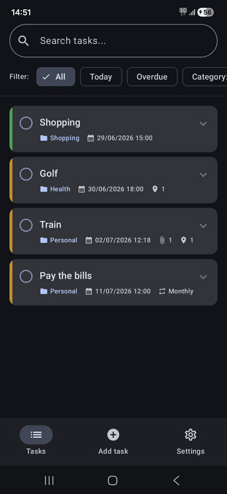
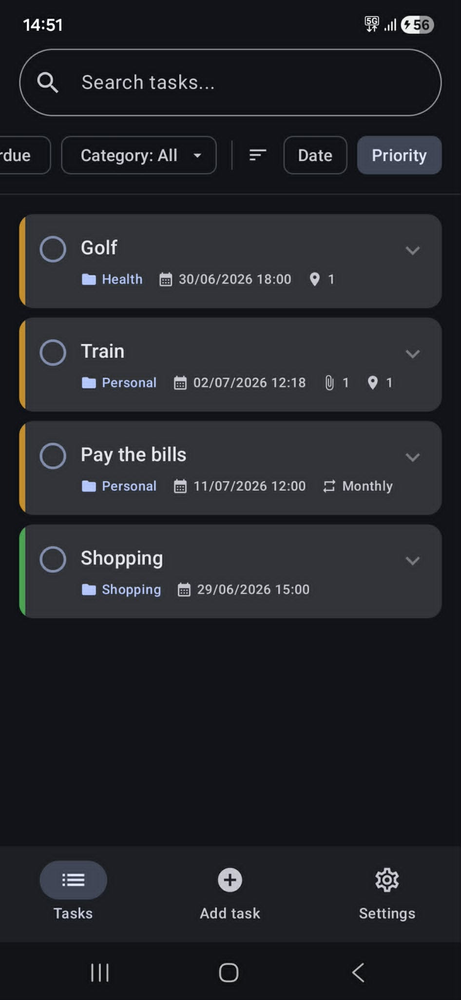
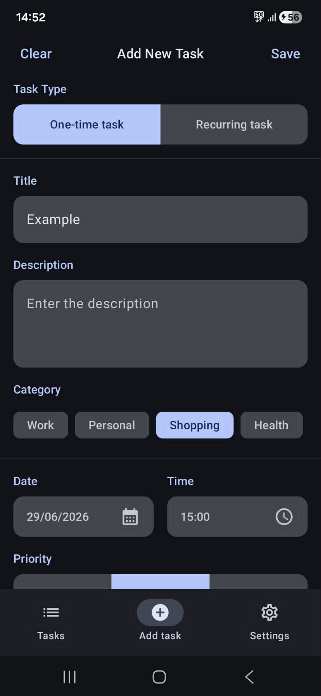
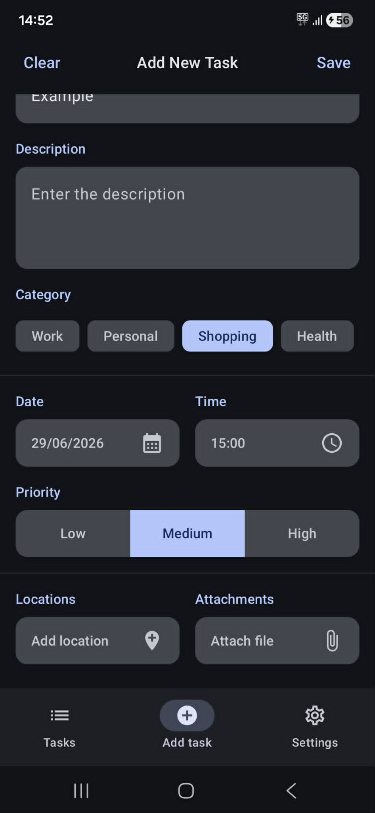
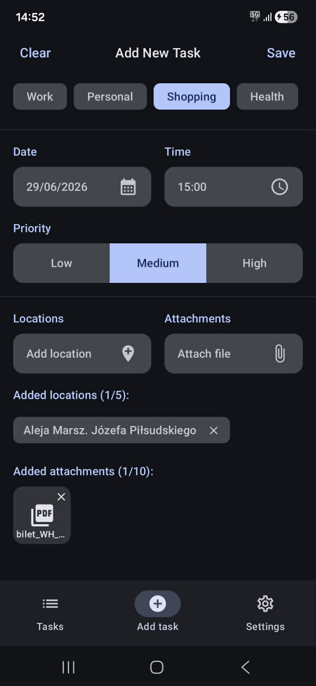
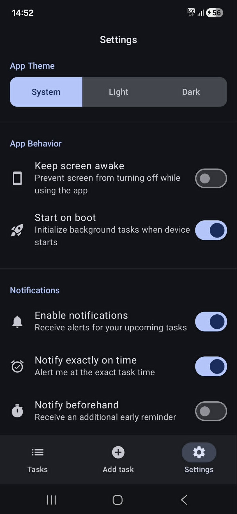
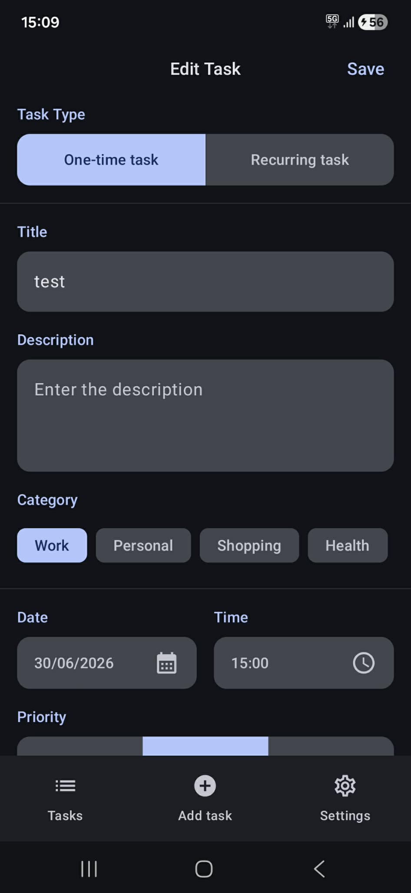
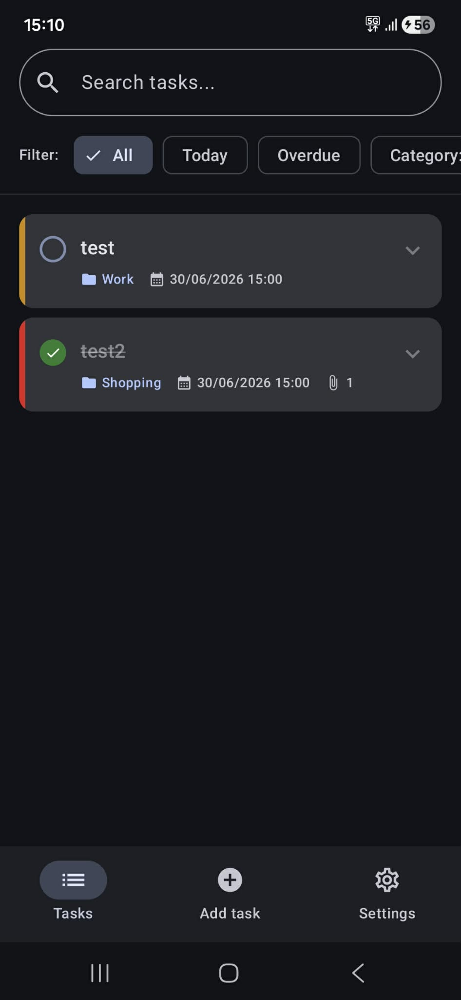
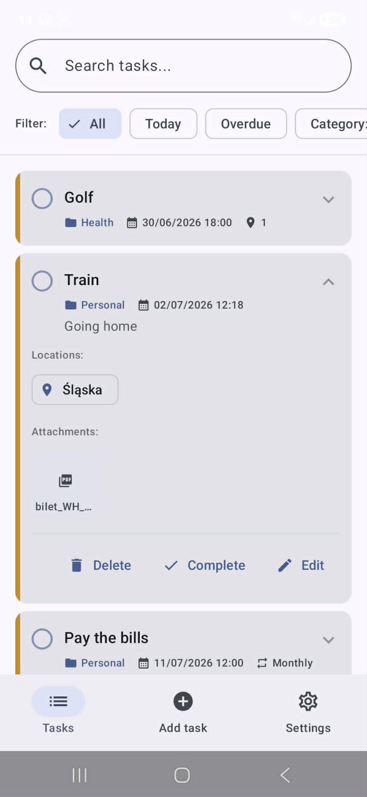

# ToDoApp

A modern, feature-rich Android task management application built entirely with Kotlin and Jetpack Compose. ToDoApp goes beyond basic task tracking by integrating advanced features like location-based reminders (geofencing), highly customizable recurring tasks, file attachments, and robust background notifications.

---

### Screens

<div align="center">
  
  
  
  
  
</div>

<div align="center">
  
  
  
  
</div>

---

## ✨ Key Features

### 🎨 Modern Declarative UI
- Built with Jetpack Compose and Material Design 3
- Smooth animations
- Swipe-to-dismiss gestures (complete/delete)
- Dynamic theming (System, Light, Dark)

### ✅ Advanced Task Management
- Create tasks with:
  - Title
  - Description
  - Due date and time
  - Priority (Low, Medium, High)
- Filter tasks by:
  - All
  - Today
  - Overdue
- Sort tasks by:
  - Date
  - Priority

### 📍 Location-Based Reminders (Geofencing)
- Integrated with Google Maps API
- Select a location directly on the map
- Configure custom geofence radius
- Receive notifications when entering a designated area

### 🔔 Smart Notifications
- Receive alerts at the exact task time
- Configure reminders before deadlines:
  - 5 minutes
  - 15 minutes
  - 1 hour
  - 1 day
- Automatic alarm restoration after device reboot using `BootReceiver`

### 🔄 Custom Recurring Tasks
- Daily recurrence
- Weekly recurrence
- Monthly recurrence
- Fully customizable intervals:
  - Every 3 weeks
  - Every 2 months
  - And more

### 📎 File Attachments
- Attach up to 10 files per task
- Supported file types:
  - Images
  - PDF documents
  - Audio files
- Open attachments seamlessly using external applications

### ⚙️ Customizable Settings
- Keep screen awake option
- Enable/disable location-based notifications
- Manage default reminder preferences
- Theme customization options

---

## 🛠️ Tech Stack & Architecture

| Category | Technology |
|-----------|------------|
| Language | Kotlin |
| UI Toolkit | Jetpack Compose (Material 3) |
| Architecture | MVVM |
| State Management | StateFlow, Flow |
| Local Database | Room Database |
| Background Tasks | AlarmManager, BroadcastReceiver |
| Location Services | Google Play Services Location |
| Maps | Google Maps Compose |
| Serialization | Gson |

### Architecture Highlights

- MVVM (Model–View–ViewModel)
- Reactive UI powered by StateFlow and Flow
- Offline-first persistence with Room Database
- Exact alarm scheduling using AlarmManager
- Geofence monitoring via Google Play Services

---

## 🚀 Getting Started

### Prerequisites

To use map and geofencing functionality, you must provide a valid Google Maps API Key.

### Installation

#### 1. Clone the Repository

```bash
git clone https://github.com/yourusername/ToDoApp.git
```

#### 2. Open in Android Studio

Open the project in Android Studio and allow Gradle to sync.

#### 3. Add Google Maps API Key

Navigate to the project root and create (or edit) the `local.properties` file:

```properties
MAPS_API_KEY=your_google_maps_api_key_here
```

#### 4. Sync Gradle

Sync the project with Gradle files.

#### 5. Run the Application

Build and run the application on:

- Android Emulator
- Physical Android Device

**Minimum SDK:** Android 7.0 (API Level 24)

---

## 📱 Permissions Used

### Location
Required for geofencing functionality:

```xml
ACCESS_FINE_LOCATION
ACCESS_COARSE_LOCATION
ACCESS_BACKGROUND_LOCATION
```

### Notifications
Required for task reminders (Android 13+):

```xml
POST_NOTIFICATIONS
```

### Exact Alarms
Required for precise scheduling:

```xml
SCHEDULE_EXACT_ALARM
USE_EXACT_ALARM
```

### Device Boot
Required to restore alarms after reboot:

```xml
RECEIVE_BOOT_COMPLETED
```

---

## 📂 Project Structure

```text
com.todoapp
├── data
│   ├── database
│   ├── repository
│   └── model
├── ui
│   ├── screens
│   ├── components
│   └── theme
├── viewmodel
├── receiver
├── notifications
├── geofencing
└── utils
```

---

## 🎯 Highlights

- Modern Material 3 UI
- Offline-first architecture
- Exact alarm scheduling
- Location-based reminders
- Flexible recurring tasks
- File attachment support
- Dynamic theme support
- Reactive state management with StateFlow

---

## 📄 License

This project is intended for educational and portfolio purposes. Feel free to modify and extend it according to your needs.
